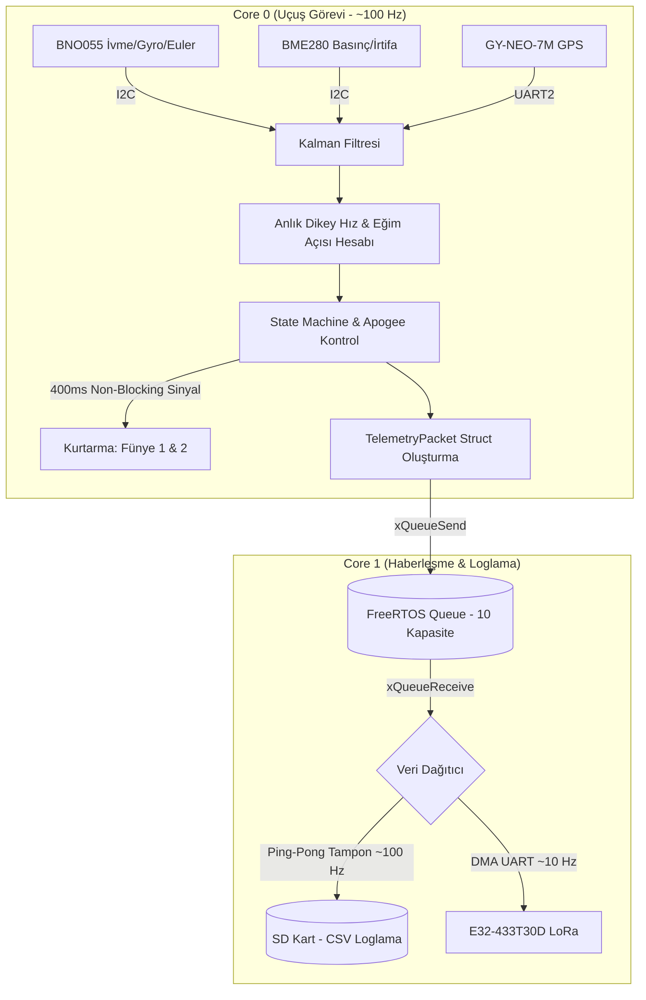
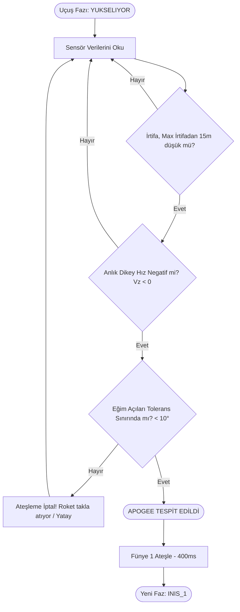

# 🚀 Trakya Roket 2026 - Uçuş Yazılımı (V2.0)


**Trakya Roket Takımı 2026** yarışmaları için sıfırdan tasarlanmış, yüksek performanslı, asenkron ve hata toleranslı görev bilgisayarı (uçuş kontrol) yazılımıdır. 

Yazılımın temel odağı ve kalbi **`main.cpp`** üzerinde koşan uçuş algoritmasıdır. Sistem; ESP32'nin çift çekirdek mimarisini, FreeRTOS kuyruk yapısını, DMA (Direct Memory Access) destekli donanım haberleşmesini ve 1D Gelişmiş Kalman filtrelerini bir araya getirerek uçuş güvenliğini en üst seviyeye çıkarmayı hedefler. SİT/SUT simülasyonları ise bu ana yapıya entegre çalışan ikincil eklenti modülleridir.

---

## 📋 İçindekiler
1. [Sistem Mimarisi & Veri Akışı](#-sistem-mimarisi--veri-akışı)
2. [Çift Çekirdek İşleme Modeli](#-çift-çekirdek-dual-core-işleme-modeli)
3. [Donanım Altyapısı ve Pinout](#-donanım-altyapısı-ve-pin-bağlantıları)
4. [Gelişmiş Uçuş Algoritmaları](#-gelişmiş-uçuş-algoritmaları)
   - [Uçuş Durum Makinesi (State Machine)](#uçuş-durum-makinesi-state-machine)
   - [Tepe Noktası (Apogee) Tespiti ve Güvenlik Kapısı](#tepe-noktası-apogee-tespiti-ve-güvenlik-kapısı)
5. [Haberleşme & Loglama Protokolü](#-haberleşme-ve-loglama-protokolü)
6. [Eklenti Modüller: SİT & SUT Testleri](#-eklenti-modüller-si̇t--sut-testleri)
7. [Proje Yapısı](#-proje-yapısı)
8. [Kurulum, Derleme ve Kullanım](#-kurulum-derleme-ve-kullanım)

---

## 🏗️ Sistem Mimarisi & Veri Akışı

Yazılımımız tek bir döngüde her şeyi yapmak yerine, kritik işleri donanım seviyesinde asenkron olarak gerçekleştirir. Sensör okumaları, filtrelemeler ve durum kararları birinci çekirdekte saniyede 100 defa güncellenirken, veri aktarımı ve kayıt işlemleri diğer çekirdeğe bırakılır.



### 🧠 Çift Çekirdek (Dual-Core) İşleme Modeli

Uçuş kontrol bilgisayarımız, FreeRTOS kullanarak ESP32'nin iki çekirdeğini görev bazlı ayırır:

*   **CORE 0 (Uçuş Görevi / Kritik Döngü):** Sadece roketin fiziki durumuna odaklanır. İrtifa, ivme ve Euler açılarını okur, bu verileri 13 farklı 1D Kalman filtresinden geçirir, anlık dikey hızı hesaplar ve **Uçuş Durum Makinesi**'ni (State Machine) işletir. Karar verilen anlarda (Apogee veya 550m) fünyelere enerji gönderir. Tüm güncel verileri paketleyip `xQueueSend` ile kuyruğa bırakır. Döngü hızı yaklaşık **100 Hz**'dir.
*   **CORE 1 (Haberleşme & Loglama / Yavaş İşler):** Uçuş hesaplamalarını kilitleme (blocking) riskini ortadan kaldırmak için çevresel iletişimler bu çekirdekte yapılır. FreeRTOS kuyruğundan paketi okur. SD karta 512-byte'lık **Ping-Pong tamponlama** mantığıyla veriyi yazar ve her 10. paketi (frekansı yaklaşık 10 Hz'e düşürerek) DMA (Direct Memory Access) üzerinden ring buffer aracılığıyla LoRa modülüne aktarır.

---

## 🛰️ Donanım Altyapısı ve Pin Bağlantıları

Görev bilgisayarı, yüksek hassasiyetli uçuş kontrolü için endüstri standardı modüller kullanmaktadır:

*   **İvmeölçer & Jiroskop (BNO055):** Donanımsal Sensör Füzyonu barındırır. CPU'ya yük bindirmeden Roll, Pitch, Yaw açılarını doğrudan hesaplanmış olarak sunar. Eğim (Tilt) hesaplamasının temelidir.
*   **Barometre (BME280):** Basınç, sıcaklık ve nem ölçer. Basınç üzerinden milimetrik hassasiyette irtifa hesaplanır ve zamana göre türevi alınarak **Anlık Dikey Hız (Vz)** tespit edilir.
*   **GPS (GY-NEO-7M):** Uçuş sonrası kurtarma ekipleri için roketin global koordinatlarını sağlar.
*   **Telemetri (E32-433T30D LoRa):** 9600 baud hızında, UART üzerinden asenkron veri yollar.
*   **Kara Kutu (SD Kart - SPI):** Verileri yüksek frekansta CSV (`ucus_log.csv`) formatında loglar.

### 🔌 ESP32 Pin Haritası (Pinout)

Sistemin kararlı çalışması için aşağıdaki konfigürasyon kesin olarak uygulanmalıdır:

| Modül / Birim | Pin İşlevi | ESP32 Pin Numarası | Açıklama |
| :--- | :--- | :---: | :--- |
| **I2C Hattı** | SDA / SCL | `21` / `22` | BNO055 ve BME280 ortak veri hattı |
| **SPI Hattı** | MISO/MOSI/SCK | `19` / `23` / `18` | SD Kart Modülü iletişimi |
| **SD Kart** | CS (Chip Select)| `5` | SD Kart seçimi |
| **GPS** | RX / TX (UART2)| `16` / `17` | GY-NEO-7M haberleşmesi |
| **LoRa (Telemetri)**| RX / TX (UART1)| `33` / `32` | E32-433T30D modülü |
| **Kurtarma (Fünye)** | Fünye 1 / Fünye 2| `27` / `14` | Ayrılma sistemlerini tetikler (Mosfet Sinyali) |
| **Göstergeler** | Buzzer / LED'ler| `12` / `13, 25, 26`| Uçuş durumu ve hata uyarı donanımları |

*(Not: Eski TTL haberleşme pinleri (1 ve 3) koddan çıkartılmış olup, UART1 ve UART2 kullanılmaktadır.)*

---

## 🧮 Gelişmiş Uçuş Algoritmaları

### Uçuş Durum Makinesi (State Machine)
Roket kalkıştan inişe kadar anlık değerlerine göre 5 ana durumdan (State) birinde bulunur:

1.  **`HAZIR` (0):** Rampa üzerinde. Sensör kalibrasyonları tamamlanmış ve `referans_basinc` alınmıştır. Z ekseninde `20 m/s²` üstü ivme aranır.
2.  **`YUKSELIYOR` (1):** Kalkış tespit edildi. Motor yanıyor ve roket tırmanışta. Maksimum irtifa sürekli güncellenir. Apogee şartları gözetlenir.
3.  **`INIS_1` (2):** Apogee'de birinci (Drogue) paraşüt ateşlendi. Roket serbest düşüş / kontrollü sürüklenme evresinde.
4.  **`INIS_2` (3):** Roket belirlenen güvenli irtifaya (`550m`) indiğinde Ana (Main) paraşüt ateşlendi.
5.  **`INDI` (4):** Dikey hız sıfırlandı ve irtifa 20 metrenin altında. Sistem veri aktarımına devam eder ancak kurtarma mekanizmaları tamamen kilitlenir.

### Tepe Noktası (Apogee) Tespiti ve Güvenlik Kapısı
Erken veya yanlış ateşlemeyi (Premature Ejection) kesinlikle önlemek için 3 aşamalı çapraz sensör kontrolü (Cross-Check) yapılır.

**Kriterler:**
1.  **İrtifa Düşüşü (BME280):** Güncel irtifa, o ana kadar kaydedilmiş maksimum irtifadan en az `15 metre` aşağıda olmalıdır.
2.  **Dikey Hız (BME280):** Anlık dikey hız negatif (`Vz < 0`) olmalıdır (Roket artık düşmektedir).
3.  **Güvenlik Kapısı (BNO055 Tilt Control):** Roketin dikeyden sapma (eğim) açısı `10°` tolerans sınırları içinde olmalıdır. **Roket yatay seyrediyorsa veya takla atıyorsa (Tumbling), basınç anormalliklerinden dolayı paraşüt açılması engellenir.**

Tüm şartlar karşılandığında, `Funye1Atesle()` fonksiyonu ile 400ms boyunca mosfetler tetiklenir (Non-Blocking bekleme ile sistem kilitlenmez).



### Anlık Dikey Hız (Vz) Hesaplaması
Barometreden alınan irtifanın mikro-saniye cinsinden zamana göre türevi alınır. Delta zaman hesaba katılarak anlık düşüş veya yükseliş hızı bulunur. Ani basınç dalgalanmalarının türevi bozmaması için bu veri de öncesinde Kalman filtresinden süzülmüş irtifa üzerinden hesaplanır.

---

## 🔄 Haberleşme ve Loglama Protokolü

### Çerçeveli Binary Veri Aktarımı (LoRa)
Paket formatı özel olarak veri kaybını, bit kaymalarını ve eksik iletimleri önleyecek sıkıştırılmış (Packed Struct) yapıda tasarlanmıştır.

`[0xAA] [0x55] [LEN: 71 Byte] [ TELEMETRİ VERİSİ ] [CRC16_HI] [CRC16_LO]`

*   **`#pragma pack(1)`:** Telemetri struct'ı bellekte boşluksuz dizilir, bu sayede RAM'den doğrudan `uart_write_bytes` ile DMA üzerinden yollanır. Bant genişliğinden maksimum tasarruf edilir.
*   **CRC16-CCITT Uygulama Katmanı:** LoRa modülleri kendi içinde RF CRC yapsa bile, UART hattındaki elektriksel gürültüler yüzünden kaybolan byte'lar veya eksik okumalar Yer İstasyonunda paketlerin çöpe dönmesine yol açar. Paket sonundaki 16-bit CRC ile yer istasyonu yazılımımız gelen her paketin bütünlüğünü matematiksel olarak doğrular.

### Ping-Pong SD Kart Tamponu (Loglama)
SD karta veriler CSV formatında satır satır yazılır: `ivmeX, ivmeY, ..., gpsEnlem, state`
Ancak SD kart yazma işlemi anlık gecikmeler (Latency/Blocking) yaratabilir. Bunu önlemek için **512 Byte'lık A ve B Buffer'ları (Ping-Pong)** kullanılır. Veriler `A` tamponuna dolar, dolduğunda DMA ile SD karta basma emri verilirken sistem duraksamaz ve veriler anında `B` tamponuna yazılmaya devam eder. Her 100 paket döngüsünde (1 saniye) bir `flush()` ile SD karta fiziksel kalıcı kayıt atılır.

---

## 🔌 Eklenti Modüller: SİT & SUT Testleri

Yazılımın ana mimarisi olan gerçek uçuş senaryosunun (`main.cpp`) yanında, yarışma kurullarının zorunlu tuttuğu entegrasyon testleri için bağımsız eklenti modülleri tasarlanmıştır.

*   **SİT (Sistem Entegrasyon Testi):** Sensör verilerinin (özellikle BNO055 ve BME280) ve ayrılma (fünye) mantıklarının yer istasyonundan canlı olarak izlenmesi.
*   **SUT (Sentetik Uçuş Testi):** Uçuş algoritmasının sanal simülasyonudur. Yer istasyonu üzerinden roket anakartına sanki uçuyormuş gibi yapay irtifa ve ivme verisi basılarak durum makinesi tetiklenir (Örneğin, roket masadayken sahte irtifa verisi 3000m yapılıp düşürülerek Apogee testi icra edilir).

*(Not: SİT/SUT detaylı yönergeleri `SİT_SUT/sit-sut-dokümantasyon.md` dosyasında yer almaktadır.)*

---

## 📂 Proje Yapısı

```bash
├── src/
│   ├── main.cpp                 # Ana uçuş yazılımı (Dual-Core, FreeRTOS, Kalman, State Machine)
│   └── SİT_SUT/
│       └── SİT-SUT.cpp          # Zorunlu test senaryosu kodları
├── include/                     # Projeye özel başlık dosyaları
├── lib/                         # İhtiyaç duyulursa yerel kütüphaneler
├── SİT_SUT/                     
│   ├── sit_sut_test.py          # SUT veri simülasyonu için Python scripti
│   └── sit-sut-dokümantasyon.md # Kurul sunumları ve test yönergeleri
├── test/
│   └── test_ucus/               # PlatformIO C++ Unit test modülleri
├── platformio.ini               # Derleme, kütüphane bağımlılıkları ve kart (ESP32) ayarları
└── README.md                    # Proje teknik dokümantasyonu
```

---

## 🚀 Kurulum, Derleme ve Kullanım

Sistem doğrudan **PlatformIO** ekosistemi üzerine kuruludur. Arduino IDE kullanılması önerilmez.

### Gerekli Adımlar:
1.  Bilgisayarınıza **VS Code** ve **PlatformIO IDE** eklentisini kurun.
2.  Bu depoyu klonlayın ve PlatformIO üzerinden proje klasörünü `Open Project` diyerek açın.
3.  `platformio.ini` dosyası sayesinde projenin ihtiyacı olan tüm kütüphaneler (`Adafruit BNO055`, `Adafruit BME280 Library`, `TinyGPSPlus` vb.) arka planda otomatik olarak indirilecektir.
4.  Donanım pinlerinizi yukarıdaki Pinout tablosuna uygun şekilde ESP32 geliştirme kartınıza bağlayın.
5.  Arayüzün sol alt kısmındaki **"Build" (✓)** ikonuna tıklayarak derlemeyi kontrol edin.
6.  ESP32'yi bilgisayarınıza bağlayın ve **"Upload" (➔)** ikonuna tıklayarak uçuş yazılımını yükleyin.

### ⚠️ Uçuş Öncesi Kontroller (Pre-Flight Checks)
- ESP32 enerjilendikten sonra BME280 yerel basıncı (referans irtifasını) otomatik olarak ölçecektir. **Sisteme enerji rampa konumunda, hareket ettirilmeden önce verilmelidir.**
- BNO055 sensörü kalibrasyon kalitesi (System/Gyro/Accel/Mag) yeterli seviyeye gelmeden uçuş durumuna geçmez. Konsoldan kalibrasyon onayı beklenmelidir.
- SD kartın takılı olduğundan ve "SD Kart Başlatıldı" loğunun alındığından emin olun.

---

**Trakya Roket Takımı 2026** - *Gelecek Göklerde!*

