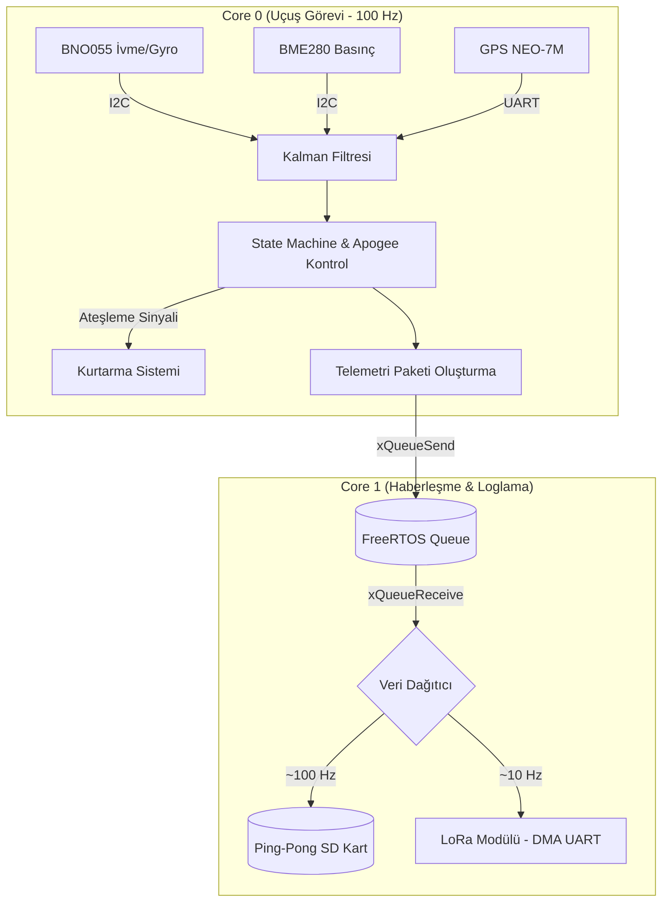
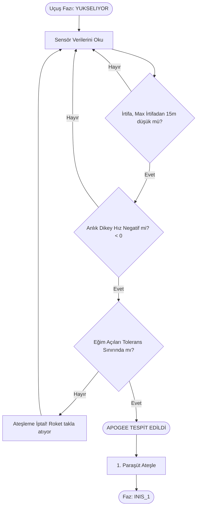

# 🚀 Trakya Roket 2026 - Uçuş Yazılımı (V2.0)


**Trakya Roket Takımı 2026** yarışmaları için sıfırdan tasarlanmış, yüksek performanslı, asenkron ve hata toleranslı görev bilgisayarı (uçuş kontrol) yazılımıdır. 

Yazılımın temel odağı ve kalbi **`main.cpp`** üzerinde koşan uçuş algoritmasıdır. Sistem; ESP32'nin çift çekirdek mimarisini, FreeRTOS kuyruk yapısını, DMA destekli donanım haberleşmesini ve Gelişmiş Kalman filtrelerini bir araya getirerek uçuş güvenliğini en üst seviyeye çıkarmayı hedefler. SİT/SUT simülasyonları ise bu ana yapıya entegre çalışan ikincil eklenti modülleridir.

---

## 🏗️ Sistem Mimarisi & Veri Akışı

Yazılımımız tek bir döngüde her şeyi yapmak yerine, kritik işleri donanım seviyesinde asenkron olarak gerçekleştirir.



### 🧠 Çift Çekirdek (Dual-Core) İşleme Modeli
- **CORE 0 (Uçuş Görevi - 100 Hz):** Sadece roketin fiziki durumuna odaklanır. Sensör verilerini okur, Kalman filtresinden geçirir, anlık dikey hız ve eğim açısını hesaplar, durum makinesini (State Machine) işletir ve kurtarma sistemi ateşlemelerine karar verir. Üretilen paketler `xQueueSend` ile kuyruğa yollanır.
- **CORE 1 (Haberleşme & Loglama):** Sensör okumalarını yavaşlatmamak için haberleşme bu çekirdekte yapılır. Kuyruktan gelen veriyi Ping-Pong Buffer mimarisi ile anında SD karta yazar (~100 Hz) ve her 10 paketten birini DMA destekli UART üzerinden LoRa ile yer istasyonuna (~10 Hz) iletir.

---

## 🛰️ Donanım Altyapısı

- **İvmeölçer & Jiroskop (BNO055):** Donanımsal Sensör Füzyonu sayesinde doğrudan doğruya Euler açıları (Roll, Pitch, Yaw) ve doğrusal ivme verisi sağlar. Yönelim (eğim) takibinde birincil sensördür.
- **Barometre (BME280):** Çok yüksek hassasiyetli basınç ölçümüyle irtifa tayini ve bunun türevi alınarak **Anlık Dikey Hız** hesabı yapılır.
- **GPS (GY-NEO-7M):** Roketin konumu ve yerinin tespiti için kullanılır.
- **Telemetri (E32-433T30D LoRa):** 9600 baud hızında, şifrelenmiş çerçeveli (framed) binary paket formatında Yer İstasyonuna asenkron veri yollar.
- **Kara Kutu (SD Kart):** Uçuş boyunca tüm verileri (saniyede 100 satır) CSV formatında kaydeder.

---

## 🧮 Gelişmiş Uçuş Algoritmaları

### Uçuş Durum Makinesi (State Machine)
Roket uçuşun her saniyesinde 5 ana fazdan birindedir:
1.  **HAZIR:** Rampa üzerinde kalibrasyon tamamlandı. Z ekseninde eşik ivmesi bekleniyor.
2.  **YUKSELIYOR:** Kalkış tespit edildi, motor itki ve sürüklenme fazı.
3.  **INIS_1 (Drogue):** Apogee'de birinci (sürüklenme) paraşütü ateşlendi.
4.  **INIS_2 (Ana):** Belirlenen güvenli irtifada (ör. 550m) ana paraşüt ateşlendi.
5.  **INDI:** İrtifa ve hız değişimleri sıfırlandı, kurtarma ekibi bekleniyor.

### Tepe Noktası (Apogee) Tespiti ve Güvenlik Kapısı
Yanlış ateşlemeleri önlemek için çapraz kontrol yapılır:
- **Kriter 1 (BME280):** İrtifa maksimum noktadan belirlenen bir pay (ör. 15m) kadar düşmeli.
- **Kriter 2 (BME280):** Anlık dikey hız negatif olmalı.
- **Kriter 3 (BNO055 - Güvenlik):** Roketin yere göre eğimi tolerans sınırları içinde olmalı (roket yatayda veya takla atarken açılmayı önler).



### Ping-Pong Buffer & DMA Mimarisi
- **SD Kart Loglama:** SD kart yazma gecikmelerinin (latency) sistemi kilitlememesi için veriler önce A tamponuna (buffer) dolar. Dolduğunda yazma emri verilirken, yeni veriler B tamponuna akmaya devam eder.
- **UART (LoRa):** Çerçevelenmiş veri paketleri UART ring buffer'ına atılarak CPU meşgul edilmeden gönderilir (Non-Blocking).

---

## 🔄 Haberleşme Protokolü

Paket formatı özel olarak veri kaybını ve bozulmaları önleyecek çerçeveli bir yapıda tasarlanmıştır:
`[SYNC_1 (0xAA)] [SYNC_2 (0x55)] [UZUNLUK] [ TELEMETRİ PAKETİ ] [CRC16_HI] [CRC16_LO]`

- **CRC16-CCITT:** Havada bozulan, buffer kayması yaşayan veya eksik inen paketler yer istasyonunda filtre edilir.
- **Struct Packing (`#pragma pack(1)`):** Değişkenlerin bellekte boşluksuz dizilmesini sağlayarak bant genişliğini maksimum verimle kullanır.

---

## 🔌 Eklenti Modüller: SİT & SUT Testleri

Yazılımın ana mimarisi olan gerçek uçuş senaryosunun (`main.cpp`) yanında, yarışma kurullarının zorunlu tuttuğu çevresel entegrasyon testleri için bağımsız eklenti modülleri tasarlanmıştır. Bu modüller sadece test aşamalarında devreye girer:
-   **SİT (Sensör İzleme Testi):** Sensör verilerinin yer istasyonu tarafından canlı okunması.
-   **SUT (Sentetik Uçuş Testi):** Yer istasyonundan roket yazılımına simülatör verisi basılarak uçuş algoritmasının sanal olarak test edilmesi.

> **SİT/SUT Arayüz Ekran Görüntüleri:**
> *Görselleri eklemek için projeye `images` klasörü açıp resimleri yükleyin ve aşağıdaki formatı kullanın:*
> 
> ``
> ``

---

## 📂 Proje Yapısı

```bash
├── src/
│   ├── main.cpp                 # Ana uçuş yazılımı (Dual-Core, FreeRTOS, Kalman)
│   └── SİT_SUT/
│       └── SİT-SUT.cpp          # SİT/SUT entegrasyon dosyası
├── include/                     # Özel kütüphane başlık dosyaları
├── lib/                         # Harici kütüphaneler (eğer varsa)
├── SİT_SUT/
│   ├── sit_sut_test.py          # Python SİT/SUT simülatörü
│   └── sit-sut-dokümantasyon.md # Test yönergeleri
├── test/
│   └── test_ucus/               # PlatformIO birim (unit) testleri
└── platformio.ini               # Kütüphane bağımlılıkları ve derleme ayarları
```

---

## 🚀 Kurulum ve Kullanım

1.  **PlatformIO IDE** (VS Code) kurulumunu gerçekleştirin.
2.  Depoyu klonlayıp PlatformIO ile projeyi (klasörü) açın.
3.  `platformio.ini` içindeki bağımlılıklar (Adafruit BNO055, BME280, TinyGPSPlus) otomatik kurulacaktır.
4.  Çevresel pin bağlantılarınızı `main.cpp` içerisindeki tanımlamalara göre yapın (Örn: UART1 TX/RX pinleri vb.).
5.  Uygulamayı derleyip ESP32'ye yüklemek için `Upload` tuşunu veya `pio run -t upload` komutunu kullanın.

### ✅ Güncel Durum & Yapılacaklar (TODO)
- [x] Çift Çekirdek (Dual-Core) RTOS entegrasyonu
- [x] Sensörlerin Kalman filtreli okunması
- [x] Çerçeveli (Framed) Binary Paket Protokolü + CRC
- [x] Non-Blocking LoRa + Ping-Pong Buffer'lı SD Kart
- [x] Güvenlikli Apogee tespit algoritması
- [ ] BNO055 Z-Ekseni Yön Kalibrasyonu kontrolü (Uçuş öncesi test edilecek)
- [ ] Buzzer ve LED uyarı sistemlerinin State Machine fazlarına entegrasyonu

---
**Trakya Roket Takımı 2026** - Gelecek Göklerde!
