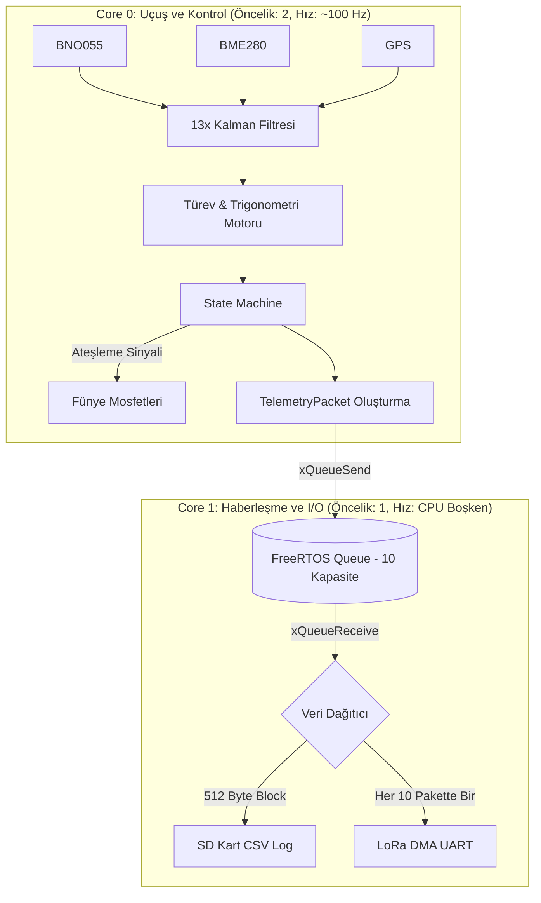

# 🚀 Trakya Roket 2026 - Uçuş Kontrol Bilgisayarı (Uçuş Yazılımı V2.0)
## Mühendislik Tasarım Raporu ve Teknik Dokümantasyon


Bu doküman, **Trakya Roket Takımı 2026** yarışma isterleri (Teknofest / IREC) doğrultusunda sıfırdan tasarlanmış olan asenkron, hata toleranslı ve deterministik görev bilgisayarı yazılımının detaylı sistem mimarisini, algoritmik temellerini ve acil durum protokollerini açıklamaktadır.

---

## 📋 İçindekiler
1. [Özet (Abstract) ve Tasarım Felsefesi](#1-özet-abstract-ve-tasarım-felsefesi)
2. [Sistem Mimarisi: Çift Çekirdek ve FreeRTOS](#2-sistem-mimarisi-çift-çekirdek-ve-freertos)
3. [Algoritmik Altyapı ve Matematiksel Modeller](#3-algoritmik-altyapı-ve-matematiksel-modeller)
   - [Sensör Füzyonu ve 1D Kalman Filtreleri](#sensör-füzyonu-ve-1d-kalman-filtreleri)
   - [Anlık Dikey Hız (Vz) ve Eğim Açısı Hesabı](#anlık-dikey-hız-vz-ve-eğim-açısı-hesabı)
   - [Apogee Tespiti ve Durum Makinesi (State Machine)](#apogee-tespiti-ve-durum-makinesi-state-machine)
4. [Haberleşme ve Veri İşleme Protokolleri](#4-haberleşme-ve-veri-i̇şleme-protokolleri)
   - [LoRa Telemetri Paketi (Packed Struct & CRC)](#lora-telemetri-paketi-packed-struct--crc)
   - [SD Kart Ping-Pong Buffer (DMA Loglama)](#sd-kart-ping-pong-buffer-dma-loglama)
5. [Hata Modları ve Etki Analizi (FMEA)](#5-hata-modları-ve-etki-analizi-fmea)
6. [Donanım Altyapısı ve Pinout (Wiring Haritası)](#6-donanım-altyapısı-ve-pinout-wiring-haritası)
7. [Kurulum, Entegrasyon (SİT/SUT) ve Çalıştırma](#7-kurulum-entegrasyon-si̇tsut-ve-çalıştırma)

---

## 1. Özet (Abstract) ve Tasarım Felsefesi

Uçuş kontrol sistemleri (Avionics), roketin aerodinamik kuvvetler altında doğru kararları saliseler içinde alabilmesini gerektirir. Önceki nesil yazılımlarda karşılaşılan "SD kart yazma gecikmesi yüzünden sensör okumanın durması" (Blocking loop) problemini aşmak için, V2.0 yazılımı **tamamen asenkron (Non-Blocking)** bir yapıya geçirilmiştir. 

Yazılımın kalbi `main.cpp` üzerinde koşmakta olup, temel odağı roketin apogee (tepe) noktasını mutlak güvenlikle tespit etmek, yanlış ayrılmaları önlemek ve uçuş verilerini %0 kayıpla yer istasyonuna iletmektir.

---

## 2. Sistem Mimarisi: Çift Çekirdek ve FreeRTOS

Geleneksel `loop()` döngüsü terkedilerek FreeRTOS (Real-Time Operating System) altyapısı kurulmuştur. ESP32'nin işlem gücü, görevlerin (Task) kritiklik derecelerine göre paylaştırılmıştır.



### Görev Dağılımı ve Önceliklendirme
1.  **Task1 (Core 0 - Priority 2):** Sistemin en yüksek öncelikli döngüsüdür. Sensörlerden I2C üzerinden veri çeker, filtreler ve uçuş algoritmasını koşturur. Ürettiği paketi `xQueueSend` ile kuyruğa atar. Kuyruk doluysa (Core 1 yetişemiyorsa) sistem beklemez, eski veriyi ezer (veya atlar), böylece **uçuş hesaplamaları asla gecikmez**.
2.  **Task2 (Core 1 - Priority 1):** Sadece `xQueueReceive` fonksiyonunda bekler (CPU'yu %0 kullanır). Veri geldiğinde uyanır, SD kartın Ping-Pong tamponlarına kopyalar ve zamanı gelmişse UART1 ring-buffer'ına basar.

---

## 3. Algoritmik Altyapı ve Matematiksel Modeller

### Sensör Füzyonu ve 1D Kalman Filtreleri
Donanımsal gürültüleri (örneğin motor titreşimi yüzünden barometredeki basınç dalgalanmaları) filtrelemek için, her bir ölçüm ekseni için 1 Boyutlu (1D) `SimpleKalmanFilter` nesneleri oluşturulmuştur.

*   **BNO055 (İvme/Gyro/Euler):** Hızlı tepki vermesi için ölçüm/tahmin hatası `0.1`, süreç gürültüsü `0.01` olarak ayarlanmıştır.
*   **BME280 (İrtifa/Basınç):** Yüksek statik gürültü sebebiyle ölçüm hatası `1.5`, süreç gürültüsü `0.1` olarak ayarlanmıştır. Bu sayede irtifa verisi çok daha pürüzsüz (smooth) bir eğri çizer.

### Anlık Dikey Hız (Vz) ve Eğim Açısı Hesabı
Apogee kararı verilebilmesi için roketin hız vektörü ve yer düzlemine göre açısı hesaplanmalıdır.

**1. Dikey Hız (Vz) Türevi:**
```text
Vz = (Güncel İrtifa - Önceki İrtifa) / (Geçen Zaman_sn)
```

*Sistem bu hesabı (mikro-saniye hassasiyetinde delta zaman bularak) her ~10ms'de bir yapar ve anlık düşüş eğilimini algılar.*

**2. Eğim (Tilt) Açısı Trigonometrisi:**
Roket BNO055 sensöründen Roll (r) ve Pitch (p) açılarını alır. Roketin Z ekseninin (burnunun) gerçek dikey ile yaptığı açı (Tilt) şu şekilde bulunur:
```text
Tilt Açısı = acos( cos(Pitch) * cos(Roll) ) * (180 / PI)
```
*(Kalman filtresi gürültüleri sebebiyle cos(p)*cos(r) çarpımı 1.0'ı aşarsa kodda `constrain` ile korunarak NaN hatası önlenmiştir.)*

### Apogee Tespiti ve Durum Makinesi (State Machine)
Durum makinesi 5 fazdan oluşur: `HAZIR`, `YUKSELIYOR`, `INIS_1`, `INIS_2`, `INDI`.
En kritik faz olan `YUKSELIYOR` modundan `INIS_1` (Drogue Ayrılma) moduna geçiş **Üçlü Onay (Cross-Check)** mekanizmasına bağlanmıştır:

1.  **Bağıl İrtifa Onayı:** $\text{İrtifa}_{\text{güncel}} < (\text{İrtifa}_{\text{maksimum}} - 15 \text{m})$
2.  **Kinetik Onay:** $V_z < 0$ (Hız vektörü yön değiştirdi)
3.  **Güvenlik (Tumbling) Onayı:** $\theta < 10^\circ$ (Eğim toleransı)

**Neden Güvenlik Onayı Gerekli?** 
Roket motor arızasıyla yatay uçuşa geçerse veya takla atmaya başlarsa, burundaki statik deliklerde oluşan rüzgar (dinamik basınç) etkileri BME280 barometresini yanıltarak "sahte bir irtifa düşüşü" algılatabilir. BNO055'ten alınan eğim açısı $<10^\circ$ şartı, roket yatayken veya takla atarken fünye ateşlemesini **kesin olarak engeller**.

---

## 4. Haberleşme ve Veri İşleme Protokolleri

### LoRa Telemetri Paketi (Packed Struct & CRC)
Veri paketimiz (Payload), bant genişliğini maksimize etmek için `#pragma pack(push, 1)` ile C++ seviyesinde byte boşluksuz olarak sıkıştırılmıştır. Değişken dizilimi:

| Veri Tipi | Boyut | İçerik |
| :--- | :--- | :--- |
| `float` (x3) | 12 Byte | ivmeX, ivmeY, ivmeZ |
| `float` (x3) | 12 Byte | gyroX, gyroY, gyroZ |
| `float` (x3) | 12 Byte | roll, pitch, yaw |
| `float` (x3) | 12 Byte | irtifa, dikeyHiz, eglimAcisi |
| `float` (x2) | 8 Byte | gpsEnlem, gpsBoylam |
| `bool` (x2) | 2 Byte | ayrilma1_durum, ayrilma2_durum |
| `uint8_t` | 1 Byte | ucus_durumu (0-4 arası State) |
| **Toplam Payload** | **59 Byte** | *Bellekte kapladığı alan* |

Yer istasyonuna gönderilen tam çerçeve (Frame) formatı ise şu şekildedir:
`[0xAA] [0x55] [LEN: 59] [ ...59 Byte Struct... ] [CRC16_HI] [CRC16_LO]` (Toplam 64 Byte). 

UART1 hattında yaşanabilecek elektriksel gürültüler veya ring-buffer kaymaları `CRC16-CCITT` algoritmasıyla tespit edilir. Yer istasyonu CRC'si tutmayan paketi (corrupted data) anında reddeder.

### SD Kart Ping-Pong Buffer (DMA Loglama)
SPI üzerinden SD karta yazma işlemi genelde 5-20ms sürer, ancak kart içi bellek yönetimi (Wear Leveling) devreye girdiğinde bu süre 200ms'ye kadar çıkabilir. Bu durum uçuş kontrolünü dondurur. 

Çözüm olarak **512 Byte'lık A ve B tamponları** oluşturulmuştur:
1. Gelen CSV satırları A tamponuna dolar.
2. A tamponu dolduğunda ESP32'nin DMA birimine "Bunu SD karta yaz" emri verilir.
3. ESP32 CPU'su beklemeden (Non-Blocking) yeni verileri anında B tamponuna yazmaya devam eder.

---

## 5. Hata Modları ve Etki Analizi (FMEA)

Sistem uçuş sırasında oluşabilecek donanımsal ve yazılımsal arızalara karşı korunmalıdır:

| Arıza Modu | Sistemin Tepkisi (Mitigation) |
| :--- | :--- |
| **BME280 Bozulması / Bağlantı Kopması** | I2C veri yolu hata fırlatır ancak Kalman filtreleri son mantıklı veriyi tutar. (Sistemin 3 bağımsız veriye ihtiyacı olduğu için kurtarma riske girer. Redundancy (Çift sensör) ileriki versiyonlarda eklenecektir.) |
| **BNO055 Kalibrasyon Kaybı** | `setup()` fonksiyonunda sistem "Kalibrasyon Puanı > 1" olmadan uçuş döngüsüne geçişi kilitler. Uçuşta bozulursa Kalman filtresi yumuşatır, ancak Tilt (Güvenlik Kapısı) hesaplamaları sapabilir. |
| **SD Kartın Takılmaması / Çıkması** | `SD.begin()` başarısız olursa `sdOk = false` bayrağı çekilir. Sistem loglama fonksiyonlarını atlar (Bypass) ancak uçuş döngüsü ve LoRa aktarımı kayıpsız devam eder. |
| **Fünye Mosfetinin Açık Kalması** | `Funye1Atesle()` fonksiyonu `delay()` kullanmaz. Zaman damgası (`millis()`) alır. Döngü içerisindeki `funye_guncelle()` fonksiyonu tam 400ms sonra (veya döngü ilk uğradığında) elektriği donanımsal seviyede keser. |
| **FreeRTOS Kuyruk Şişmesi** | Core 1 (Haberleşme) kilitlenirse veya LoRa gecikirse, Core 0 (Uçuş) `xQueueSend(..., 0)` kullandığı için beklemeyi reddeder ve o anki paketi silip yoluna devam eder. |

---

## 6. Donanım Altyapısı ve Pinout (Wiring Haritası)

*Not: Kullanılmayan eski TTL (RX:1, TX:3) bağlantıları yazılımdan temizlenmiş olup, DMA yetenekli pinlere göç edilmiştir.*

| Donanım Birimi | Pin Sinyali | ESP32 Pin Numarası | Özel Ayarlar |
| :--- | :--- | :---: | :--- |
| **I2C Veriyolu** | SDA / SCL | `21` / `22` | BNO055 (`0x28`), BME280 (`0x76` / `0x77`) |
| **SPI Veriyolu (SD)** | SCK / MISO / MOSI | `18` / `19` / `23` | SPI hız limitleri donanımsal uygulanır |
| **SD Kart** | CS / DET (Algılama) | `5` / `35` | CS aktiftir, DET input pull-up'tır |
| **GPS (GY-NEO-7M)** | RX2 / TX2 | `16` / `17` | `9600 Baud`, UART2 modülü |
| **LoRa (E32)** | RX1 / TX1 | `33` / `32` | `9600 Baud`, UART1 Modülü (DMA Ring-Buffer 2048B) |
| **Mosfet (Fünyeler)**| Fünye 1 / Fünye 2| `27` / `14` | Normalde LOW, 400ms HIGH sinyali (3.3V gate) |
| **Uyarı Birimleri** | Buzzer / LED 1,2,3 | `12` / `26, 4, 25`| Uçuş fazı ve hata sinyalizasyonu |

---

## 7. Kurulum, Entegrasyon (SİT/SUT) ve Çalıştırma

### Kurulum Adımları
Sistem, Arduino IDE'nin eski ve senkron kütüphane yapısı yerine **PlatformIO** profesyonel derleme ortamı kullanılarak tasarlanmıştır.

1.  Bilgisayarınıza **VS Code** ve **PlatformIO IDE** eklentisini kurun.
2.  Depoyu bilgisayarınıza klonlayın ve PlatformIO içerisinden klasörü açın.
3.  Kütüphaneler (`Adafruit BNO055`, `BME280`, `TinyGPSPlus` vb.) `platformio.ini` üzerinden otomatik olarak indirilecektir.
4.  "Build" butonu ile C++11 (veya üstü) standartlarında derleyin ve ESP32'ye "Upload" edin.

### SİT/SUT (Sistem / Sentetik Uçuş Testleri)
Yarışma komitelerinin zorunlu tuttuğu algoritmik yeterlilik testleri için yazılıma uçuş simülatörü kabiliyeti kazandırılmıştır. Gerçek sensör verileri iptal edilip, Python tabanlı bir yer istasyonundan (Bkz: `SİT_SUT/sit_sut_test.py`) UART üzerinden yapay irtifa ve ivme verisi basılarak uçuş evreleri (Örn: 3000m'ye çıkıp düşme senaryosu) sanal olarak icra edilebilir.

### Uçuş Öncesi Zorunlu Kontroller (Pre-Flight Checks)
- [ ] ESP32 enerjilendikten sonra roket rampa üzerinde **sabit tutulmalıdır**. BME280 yerel basıncı (0 m irtifası) ölçmek için 20 iterasyonluk bir ortam kalibrasyonu yapar.
- [ ] BNO055 sensörü yer manyetik alanına ve jiroskop sapmalarına karşı kendi kendini kalibre edene kadar sistem "Kalibrasyon Bekleniyor" loğu atar. Kalkış onayı için bu kalibrasyon seviyesinin minimum (1/3) olması şarttır.
- [ ] Fünye hatlarının dirençleri (Continuity Check) ve pil voltajları mekanik ekip tarafından son kez manuel kontrol edilmelidir.

---

**Trakya Roket Takımı 2026** - *Per aspera ad astra!*


